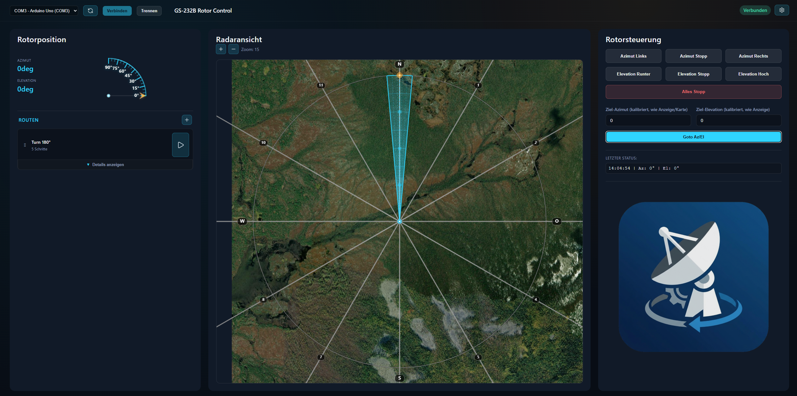

# Rotor-Interface GS232B



Webbasierte Rotor-Steuerung für GS-232B-kompatible Controller mit Python-Backend, REST-API und WebSocket-Synchronisierung für mehrere Clients.

Die Anwendung besteht aus:

- einem modularen Python-Server (`server/`) für Serial-Kommunikation, API, WebSocket, Sessions und Routenausführung
- einem statischen Frontend (`src/renderer/`) in HTML/CSS/JavaScript

Wichtiger Architekturpunkt:
Das Frontend steuert den Rotor nicht direkt per Web Serial, sondern immer über die Server-API.

---

## Inhalt

- [1. Funktionsumfang (Ist-Stand)](#1-funktionsumfang-ist-stand)
- [2. Voraussetzungen](#2-voraussetzungen)
- [3. Installation](#3-installation)
- [4. Starten](#4-starten)
- [5. Bedienung der Weboberfläche](#5-bedienung-der-weboberfläche)
- [6. Konfiguration und Persistenz](#6-konfiguration-und-persistenz)
- [7. REST-API komplett](#7-rest-api-komplett)
- [8. Routenformat und Ausführung](#8-routenformat-und-ausführung)
- [9. WebSocket-Schnittstelle](#9-websocket-schnittstelle)
- [10. Session- und Multi-Client-Modell](#10-session--und-multi-client-modell)
- [11. Entwicklung](#11-entwicklung)
- [12. Tests und CI](#12-tests-und-ci)
- [13. Integrationsbeispiele](#13-integrationsbeispiele)
- [14. Troubleshooting](#14-troubleshooting)
- [15. Sicherheitshinweise](#15-sicherheitshinweise)
- [16. Aktuelle Einschränkungen](#16-aktuelle-einschränkungen)
- [17. Weiterführende Dokumentation](#17-weiterführende-dokumentation)
- [18. Lizenz](#18-lizenz)

---

## 1. Funktionsumfang (Ist-Stand)

### Kernfunktionen

- Serverseitige COM-Port-Verbindung mit `pyserial`
- REST-API für Steuerung, Konfiguration, Routen und Client-Management
- WebSocket-Broadcast für Live-Synchronisierung über mehrere Browser-Clients
- Live-Status mit:
  - Adapter-RAW-Werten (`rph`)
  - korrigierten RAW-Werten (`correctedRaw`, optional über Feedback-Faktoren)
  - kalibrierten Werten (`calibrated`, Offset/Skalierung)
- Steuerung:
  - manuell (`left/right/up/down`)
  - Zielposition kalibriert (`/api/rotor/set_target`)
  - Zielposition raw (`/api/rotor/set_target_raw`)
  - direkte Low-Level-Kommandos (`/api/rotor/command`)
  - Home/Park-Presets (`/api/rotor/home`, `/api/rotor/park`)
- Route-Editor im Frontend, serverseitige Routenausführung:
  - `position`-, `wait`- und `loop`-Schritte
  - manuelles Weiterlaufen bei manuellen Wait-Schritten
  - Fortschrittsmeldungen via WebSocket
- Einstellungsdialog mit Tabs:
  - Verbindung
  - Anzeige
  - Karte
  - Geschwindigkeit (inkl. ERC-DUO-Stufenfelder)
  - Rampe
  - Kalibrierung
  - Clients
  - Server
- Session-Management:
  - Session-IDs
  - Suspend/Resume einzelner Clients
  - optionales Erzwingen gültiger Session-Header (`serverRequireSession`)

### Im Repository zusätzlich enthalten

- Arduino-Testaufbau/Emulation: `hardware_test/`
- Architekturdiagramme: `diagrams/`

---

## 2. Voraussetzungen

- Python 3.10+ (empfohlen: 3.11+)
- Pip
- Für echte Hardwaresteuerung: Zugriff auf serielle Schnittstelle
- Optional:
  - Node.js + npm (nur für JS-Tests und optionales statisches Frontend-Serving)

Python-Abhängigkeiten (aus `requirements.txt`):

- `pyserial>=3.5`
- `pytest>=8.2`
- `websockets>=12.0`

---

## 3. Installation

```bash
pip install -r requirements.txt
```

Optional für JS-Tests:

```bash
npm ci
```

---

## 4. Starten

### Empfohlener Start

```bash
python -m server.main --port 8081 --websocket-port 8082
```

Alternativen:

```bash
python -m server
```

### Windows-Startskript

```bat
start_server.bat
```

Das Skript:

- liest HTTP/WS-Ports aus `web-settings.json`
- beendet alte `python -m server.main`-Prozesse
- startet den Server neu
- führt bei Exit-Code `42` automatisch einen Restart aus (wird von `/api/server/restart` genutzt)

### Aufruf im Browser

- `http://localhost:8081`
- oder `http://<SERVER-IP>:8081` im LAN

### API-Dokumentation im Browser

- Swagger UI: `http://localhost:8081/api/docs`
- OpenAPI JSON: `http://localhost:8081/api/openapi.json`
- ReDoc: `http://localhost:8081/api/redoc`

Die UI-Dateien für Swagger/ReDoc werden lokal vom Server ausgeliefert (`/api/docs/assets/...`) und benötigen keine CDN-Verbindung.

### Wichtiger Port-Hinweis

In der aktuellen Implementierung haben Werte aus `web-settings.json` Vorrang. CLI-Parameter sind effektiv Fallback.

---

## 5. Bedienung der Weboberfläche

### 5.1 Verbinden

1. Portliste aktualisieren
2. COM-Port auswählen
3. `Verbinden`

### 5.2 Steuerung

- Manuelle Buttons: links/rechts/hoch/runter/stop
- Goto-Eingaben senden aktuell Raw-Werte (Hardwareposition)
- Kartenklick:
  - berechnet Ziel-Azimut aus Klickposition
  - sendet Raw-Azimut (nur Azimut)

Video: Steuerung per Maus-Klicks

<video src="docs/images/Control-via-mouse-clicks.mp4" controls muted playsinline width="100%"></video>

Falls der Video-Player in deinem Markdown-Viewer nicht sichtbar ist:
[Control-via-mouse-clicks.mp4](docs/images/Control-via-mouse-clicks.mp4)

### 5.3 Routen

- Routen im linken Panel erstellen/bearbeiten
- Schrittarten:
  - Position
  - Wait (zeitbasiert oder manuell)
  - Loop (inkl. verschachtelter Schritte)
- Ausführung ist serverseitig und wird per WebSocket an alle Clients gespiegelt

Video: Routen-Ausfuehrung

<video src="docs/images/Route-execution.mp4" controls muted playsinline width="100%"></video>

Falls der Video-Player in deinem Markdown-Viewer nicht sichtbar ist:
[Route-execution.mp4](docs/images/Route-execution.mp4)

### 5.4 Einstellungen

Der Modal-Dialog schreibt in `web-settings.json` (über API). Server-Settings (Ports, Polling, Logging etc.) werden separat über `/api/server/settings` gespeichert.

Bei Portänderungen zeigt das UI korrekt an, dass ein Serverneustart notwendig ist.

---

## 6. Konfiguration und Persistenz

### 6.1 `web-settings.json`

Zentrale Konfigurationsquelle (vom Server geladen/geschrieben). Beispiele:

- Verbindung: `portPath`, `baudRate`, `pollingIntervalMs`
- Kartenansicht: `mapLatitude`, `mapLongitude`, `mapSource`, `mapType`, Zoom
- Darstellung: `coneAngle`, `coneLength`, `azimuthDisplayOffset`
- Bewegung: `azimuthMode`, Speed-Werte, Ramp-Werte
- Limits: `azimuthMinLimit`, `azimuthMaxLimit`, `elevationMinLimit`, `elevationMaxLimit`
- Kalibrierung:
  - `azimuthOffset`, `elevationOffset`
  - `azimuthScaleFactor`, `elevationScaleFactor`
  - `feedbackCorrectionEnabled`, `azimuthFeedbackFactor`, `elevationFeedbackFactor`
- Presets: `parkPositionsEnabled`, `homeAzimuth`, `homeElevation`, `parkAzimuth`, `parkElevation`, `autoParkOnDisconnect`
- Server: `serverHttpPort`, `serverWebSocketPort`, `serverPollingIntervalMs`, `serverSessionTimeoutS`, `serverMaxClients`, `serverLoggingLevel`, `serverRequireSession`

### 6.2 `routes.json`

Persistente Routenablage (serverseitig). CRUD erfolgt über `/api/routes...`.

## 7. REST-API komplett

Base URL: `http://<host>:<http-port>`

### 7.1 Rotor

| Methode | Endpoint | Beschreibung |
|---|---|---|
| GET | `/api/rotor/ports` | Verfügbare serielle Ports |
| POST | `/api/rotor/connect` | Verbinden (`port`, `baudRate`) |
| POST | `/api/rotor/disconnect` | Trennen |
| GET | `/api/rotor/status` | Verbindungsstatus + Positionsdaten |
| GET | `/api/rotor/position` | Positionsdaten + Cone-Parameter |
| POST | `/api/rotor/manual` | Manuelle Bewegung (`direction`) |
| POST | `/api/rotor/stop` | Alles stoppen |
| POST | `/api/rotor/set_target` | Zielposition kalibriert (`az`, `el`) |
| POST | `/api/rotor/set_target_raw` | Zielposition raw (`az`, `el`) |
| POST | `/api/rotor/command` | Direktes GS-232B-Kommando |
| POST | `/api/rotor/home` | Home-Preset anfahren |
| POST | `/api/rotor/park` | Park-Preset anfahren |

### 7.2 Einstellungen

| Methode | Endpoint | Beschreibung |
|---|---|---|
| GET | `/api/settings` | Gesamte Konfiguration |
| POST | `/api/settings` | Teil-Update Konfiguration |

### 7.3 Server

| Methode | Endpoint | Beschreibung |
|---|---|---|
| GET | `/api/server/settings` | Aktive Serverparameter |
| POST | `/api/server/settings` | Update Serverparameter |
| POST | `/api/server/restart` | Geordneter Neustart |

### 7.4 Sessions/Clients

| Methode | Endpoint | Beschreibung |
|---|---|---|
| GET | `/api/session` | Session holen/erzeugen |
| GET | `/api/clients` | Alle Sessions |
| POST | `/api/clients/{id}/suspend` | Session sperren |
| POST | `/api/clients/{id}/resume` | Session freigeben |

### 7.5 Routen

| Methode | Endpoint | Beschreibung |
|---|---|---|
| GET | `/api/routes` | Alle Routen |
| POST | `/api/routes` | Route anlegen |
| PUT | `/api/routes/{id}` | Route aktualisieren |
| DELETE | `/api/routes/{id}` | Route löschen |
| POST | `/api/routes/{id}/start` | Route starten |
| POST | `/api/routes/stop` | Aktive Route stoppen |
| POST | `/api/routes/continue` | Manuellen Wait-Schritt fortsetzen |
| GET | `/api/routes/execution` | Ausführungsstatus |

### 7.6 API-Dokumentation (OpenAPI/Swagger/ReDoc)

| Methode | Endpoint | Beschreibung |
|---|---|---|
| GET | `/api/openapi.json` | OpenAPI 3.1 Spezifikation |
| GET | `/api/docs` | Swagger UI (interaktiv, inkl. "Try it out") |
| GET | `/api/redoc` | ReDoc-Ansicht |

Hinweise:

- Die Doku-Endpunkte sind bewusst öffentlich erreichbar, auch wenn `serverRequireSession=true`.
- Swagger/ReDoc laufen ohne externe CDN-Abhängigkeit; alle benötigten Assets kommen lokal vom Server.
- Sicherheitsanforderungen der übrigen Endpunkte sind in der Spec enthalten:
  - mit `serverRequireSession=false`: Session optional
  - mit `serverRequireSession=true`: `X-Session-ID` erforderlich

### 7.7 Status-Payload (`/api/rotor/status`)

Bei verbundener Hardware liefert `status`:

- `rawLine`: Originalzeile vom Controller
- `timestamp`: Epoch ms
- `rph`: Adapter-RAW
- `correctedRaw`: RAW nach optionaler Feedback-Korrektur
- `calibrated`: Anzeige-/Steuerwerte nach Offset/Skalierung

### 7.8 Fehlercodes

- `200` OK
- `400` Bad Request
- `401` wenn `serverRequireSession=true` und Session fehlt/ungültig
- `403` bei suspendierter Session
- `404` not found
- `500` internal error

---

## 8. Routenformat und Ausführung

Eine Route ist ein Objekt mit `id`, `name`, optional `description`, `steps`, optional `order`.

### Schrittarten

1. `position`
   - Felder: `azimuth`, `elevation`, optional `name`
2. `wait`
   - zeitbasiert: `duration` (ms), optional `message`
   - manuell: `duration` fehlt oder `0`
3. `loop`
   - `iterations`:
     - Zahl > 0 = feste Wiederholungen
     - `0`, `null` oder `Infinity` = Endlosschleife (mit Sicherheitslimit)
   - `steps`: verschachtelte Schritte

### Ausführungslogik (Backend)

- Position wird als Raw-Ziel gesendet (`set_target_raw`)
- Ankunft gilt bei Toleranz von 2° (Az/El)
- Timeout pro Positionsschritt: 60 s, danach Weiterlauf
- Bei manuellen Waits wird auf `/api/routes/continue` gewartet
- Stop über `/api/routes/stop`

---

## 9. WebSocket-Schnittstelle

### Verbindungsadresse

- Standard: `ws://<host>:8082`
- Port ist konfigurierbar (`serverWebSocketPort`)

### Session-Registrierung

Nach WS-Connect sollte der Client seine Session registrieren:

```json
{ "type": "register_session", "sessionId": "<id>" }
```

### Server-Events

- `connection_state_changed`
- `client_list_updated`
- `client_suspended`
- `settings_updated`
- `route_list_updated`
- `route_execution_started`
- `route_execution_progress`
- `route_execution_stopped`
- `route_execution_completed`

Zusätzlich:

- Client kann `ping` senden, Server antwortet mit `pong`.

---

## 10. Session- und Multi-Client-Modell

- Session-ID wird über `GET /api/session` erzeugt
- API-Calls können `X-Session-ID` Header senden
- Standardmäßig ist Session nicht zwingend (`serverRequireSession=false`)
- Wenn aktiviert:
  - fehlende/ungültige Session führt zu `401`
- Suspendierte Sessions erhalten `403` und WS-Suspend-Event
- Session-Cleanup:
  - periodisch (Timeout konfigurierbar)
  - bei WS-Disconnect wird Session entfernt

---

## 11. Entwicklung

### 11.1 Projektstruktur

```text
server/
  api/              HTTP-Handler, Routing, Middleware, WebSocket
  config/           Defaults + Settings-Manager
  connection/       Port-Scanner + Serial-Verbindung
  control/          Rotor-Logik, Kalibrierung, Limits
  core/             Server-Lifecycle, Singleton-State, Sessions
  routes/           Route-CRUD + Route-Executor
  utils/            Logging

src/renderer/
  services/         API/WS/Config-Service-Layer
  ui/               UI-Komponenten
  index.html        UI-Layout
  main.js           Frontend-Orchestrierung
```

### 11.2 Backend-Entry-Points

- `server/main.py` (CLI)
- `server/__main__.py` (`python -m server`)

### 11.3 Frontend-Architektur

- kein Build-Schritt nötig, statische Assets
- Kommunikation ausschließlich über:
  - REST (Fetch)
  - WebSocket

### 11.4 Für lokale UI-Entwicklung

`npm run serve` startet nur statische Dateien auf Port `4173`.

Wichtig:
Das Frontend nutzt `window.location.origin` als API-Base. Ohne Reverse-Proxy zeigt es dann auf `:4173` statt auf den Python-Server.
Für vollständige Funktion die UI über den Python-Server (`:8081`) laden.

---

## 12. Tests und CI

### Python

```bash
pytest -q
```

### JavaScript

```bash
npm test
```

### Aktueller Stand (lokal geprüft am 2026-03-29)

- Python: `95 passed`
- Node: `1 passed`

Hinweis:
Aktuell gibt es Deprecation-Warnungen aus `websockets` (Legacy-Importpfad), Tests laufen aber grün.

### CI

GitHub Actions Workflow: `.github/workflows/tests.yml`

- Python-Job (3.11)
- Node-Job (20)

---

## 13. Integrationsbeispiele

### 13.1 Python (requests)

```python
import requests

BASE = "http://localhost:8081"

# Session holen
s = requests.get(f"{BASE}/api/session").json()
sid = s["sessionId"]
headers = {"X-Session-ID": sid}

# Ports
ports = requests.get(f"{BASE}/api/rotor/ports", headers=headers).json()["ports"]
print(ports)

# Verbinden
requests.post(
    f"{BASE}/api/rotor/connect",
    headers=headers,
    json={"port": "COM3", "baudRate": 9600},
)

# Status
status = requests.get(f"{BASE}/api/rotor/status", headers=headers).json()
print(status)

# Stop
requests.post(f"{BASE}/api/rotor/stop", headers=headers)
```

### 13.2 JavaScript (WebSocket)

```js
const ws = new WebSocket("ws://localhost:8082");

ws.onopen = () => {
  ws.send(JSON.stringify({
    type: "register_session",
    sessionId: "<session-id>"
  }));
};

ws.onmessage = (evt) => {
  const msg = JSON.parse(evt.data);
  console.log(msg.type, msg.data);
};
```

---

## 14. Troubleshooting

### Port wird angezeigt, Verbindung schlägt fehl

- COM-Port durch anderes Programm belegt?
- Richtige Baudrate?
- Benutzerrechte auf serielle Schnittstelle?

### UI zeigt „Server nicht erreichbar“

- Läuft `python -m server.main`?
- Browser wirklich auf `http://localhost:8081` geöffnet?

### Keine WebSocket-Updates

- Prüfen, ob `websockets` installiert ist (`pip install -r requirements.txt`)
- Port-Konflikt auf WS-Port (`8082` oder konfigurierter Port)

### Portwechsel greift nicht

- Nach Änderung von `serverHttpPort`/`serverWebSocketPort` Neustart ausführen (`/api/server/restart` oder `start_server.bat`)

### Session-Probleme

- Bei `serverRequireSession=true` immer `GET /api/session` aufrufen und `X-Session-ID` senden
- Bei Suspendierung Seite neu laden (neue Session)

---

## 15. Sicherheitshinweise

- Keine Authentifizierung eingebaut
- CORS offen (`*`)
- Für produktive Nutzung nur in vertrauenswürdigen Netzen betreiben
- Für externe Bereitstellung Reverse-Proxy + TLS + Netzsegmentierung/Firewall verwenden

---

## 16. Aktuelle Einschränkungen

- Kein aktiver Browser-Web-Serial-Modus im aktuellen Frontend
- Cross-Origin-Preflight ist aktuell auf `GET, POST, OPTIONS` begrenzt (relevant für browserbasierte Fremd-Clients bei `PUT/DELETE`)

---

## 17. Weiterführende Dokumentation

- [API_Dokumentation.md](API_Dokumentation.md)
- [GS232B_Befehle.md](GS232B_Befehle.md)
- [hardware_test/README.md](hardware_test/README.md)
- [diagrams/](diagrams/)

---

## 18. Lizenz

GPL-3.0-or-later, siehe [LICENSE](LICENSE).
